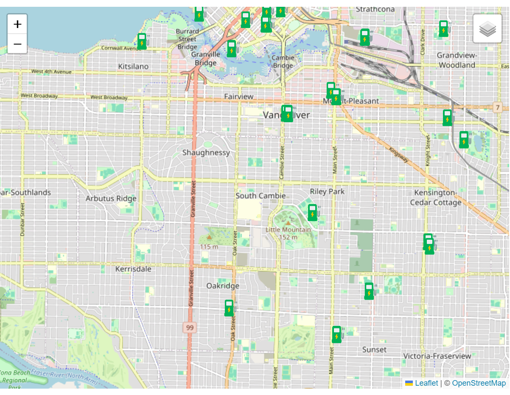
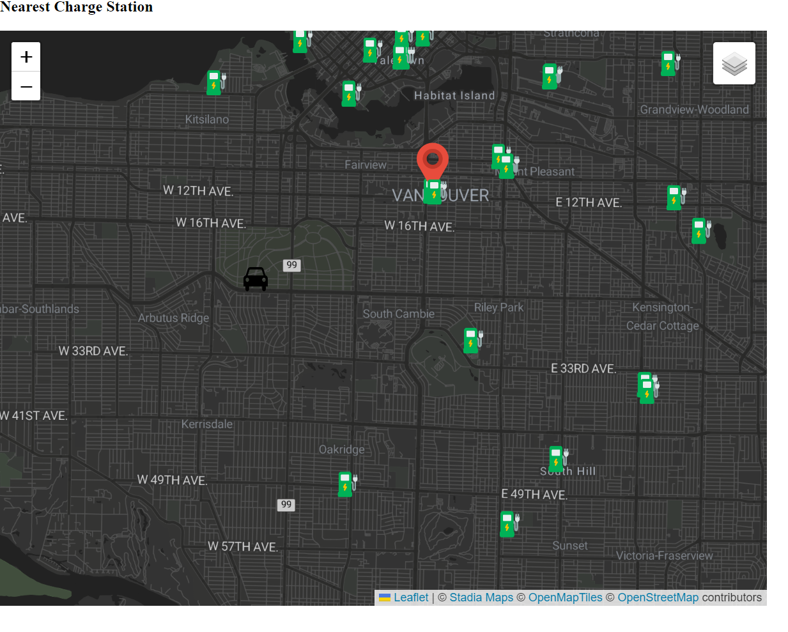

### Nearest Charge Station

The map is based on the source from *City Of Vancouver* and refer to multiply Leaflet Tutorials, including *Markers with Custom Icon*, *Layer Group and Layer Control*. The design is inspirited by a Mapbox project *Analyze data with Turf.js and Mapbox GL JS*, but the code in this projected in not used. 

This map is designed for electronic vehicle drivers looking for the closest charging stations. I designed three interactive features. First, I added a layer controller for changing the style of the basemap to improve the user experience for people driving at the night. Second, the marks have popup to show users the address. Third, While users click the map, a car icon will appear where they clicked, and a red marker will label the closest charging stations.   

This map complete basic feature of a navigator, but still lack the practicality. This map uses the turf package to measures the linear distance and return the closest point. Using the distance of practical roads is a suitable methods, but I cannot achieve relative algorithm due the limitation of time and skill. This map offers users two display modes: bright mode and dark mode, allowing them to adjust the basemap according to their preferences. However, the default setting is bright mode, so the map will display the bright basemap whenever the website are reloaded. Third, when turf find the nearest charging stations, the map use another marker to overlay the existed one. The current approach is chosen to avoid potential errors from modifying the added markets. Fourth, the users interface flexibility is the shortage of this map. This map only provide one way to calculate the nearest points. Fifth. This map lacks affordance. For instance, users may not know they can click the blank part of the map. +

Resource: 

https://docs.mapbox.com/help/tutorials/analysis-with-turf/
https://leafletjs.com/examples/custom-icons/
https://leafletjs.com/examples/layers-control/